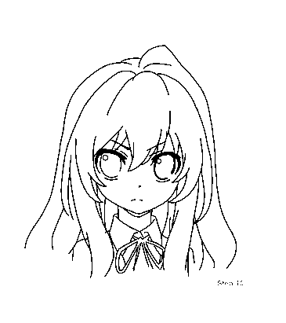

# 🖌 AutoPaint

A simple console app to draw images in MS paint.

## Introduction
This program takes control of your cursor and manipulates it to draw paintings from images.

Since it uses your cursor, you won't be able to really do anything while the program is drawing your image. However, you can move your mouse to pause the drawing and continue at any point while the program is still running. Please keep in mind that you should avoid moving the window it's drawing on to not mess up the drawing.

## How to use
1. Clone the repo.
2. Position MS Paint to the top left of your screen [like this](https://user-images.githubusercontent.com/46462862/127742196-d41aecee-f61a-48c9-b19d-37436569fa30.png) and make sure the pencil/brush is selected.
3. Navigate to `src/bin/build` and run the application.
4. Make sure the application is not overlapping with MS Paint at the top left area of your screen and follow its instructions.

To change the image that will be drawn, simply replace `assets/image.jpg` with your own image. Use images with high dark and bright contrasts, like drawing outlines for the best results.

You may use any application where you can click and drag to draw, but I've only tested this using MS Paint.

# Results
Here's a collection of results while using the application.

